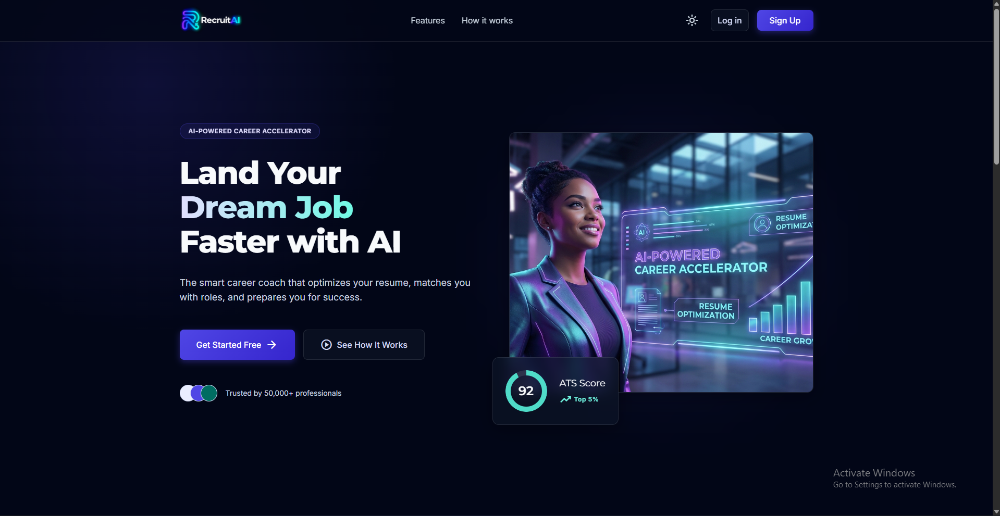
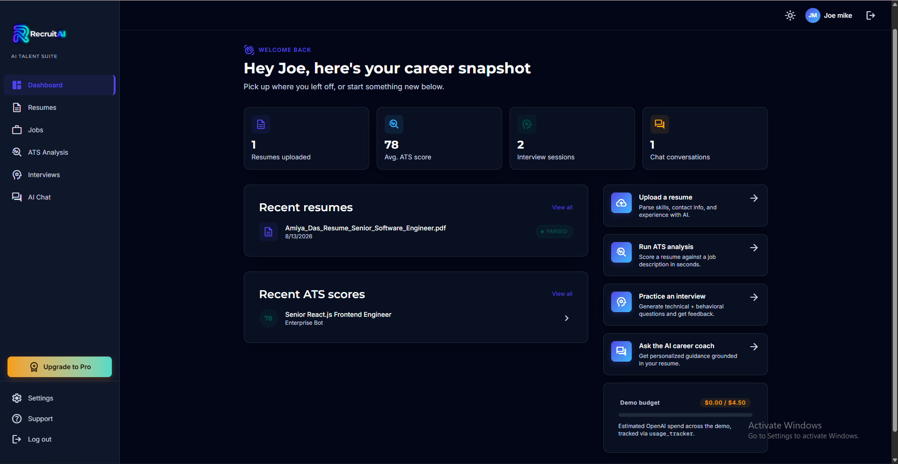
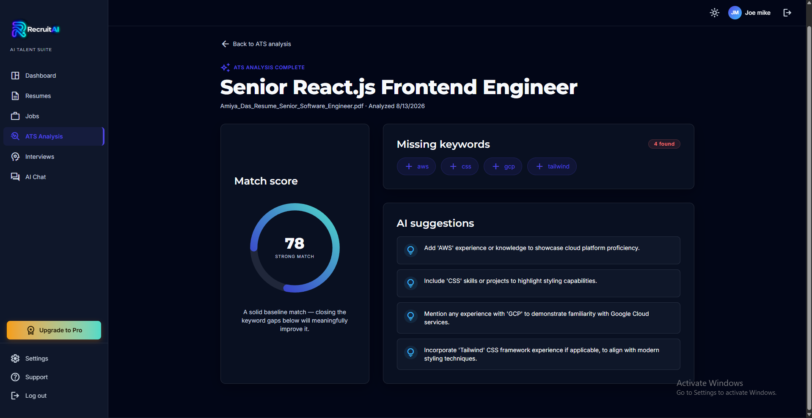
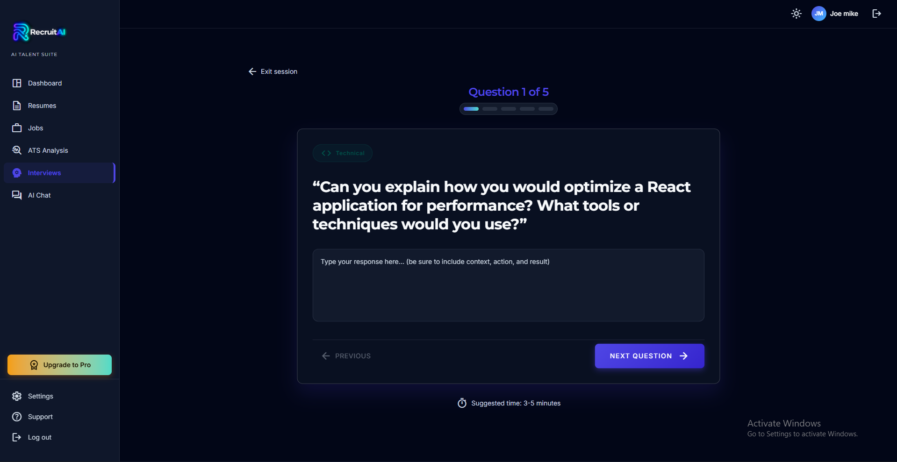
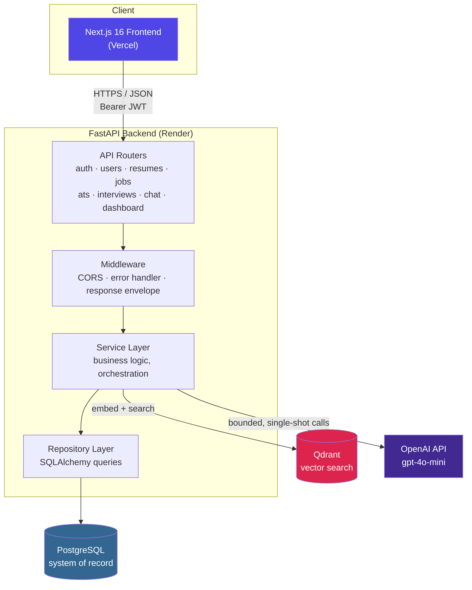
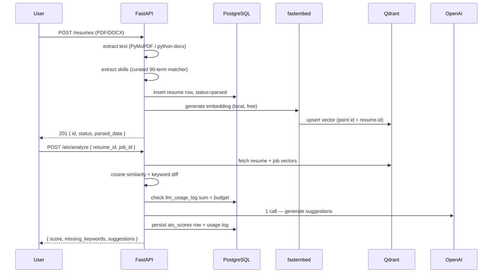
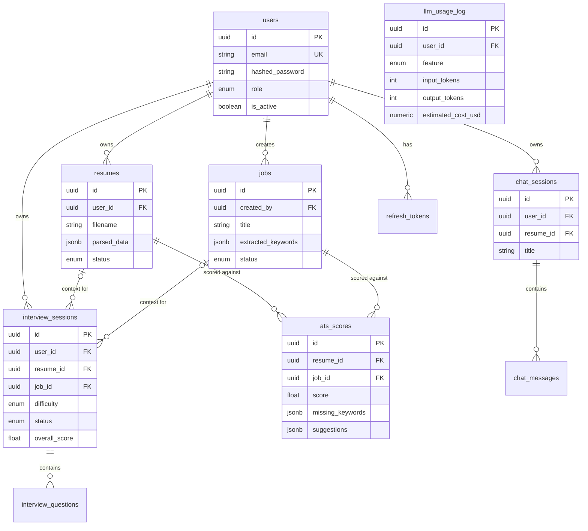

<div align="center">

# RecruitAI

**AI-powered resume analysis, ATS scoring, mock interviews, and career chat — built as a full-stack, production-shaped system.**

[](https://recruit-ai-tau.vercel.app)
[](https://recruit-ai-jfut.onrender.com/docs)


</div>

---

## Preview

<!--
  Drop real screenshots into docs/screenshots/ with these exact filenames
  and this section renders automatically — no markup changes needed.
-->

<table>
  <tr>
    <td width="50%"><p align="center"><sub>Landing page</sub></p></td>
    <td width="50%"><p align="center"><sub>Dashboard overview</sub></p></td>
  </tr>
  <tr>
    <td width="50%"><p align="center"><sub>ATS analysis result</sub></p></td>
    <td width="50%"><p align="center"><sub>Mock interview practice</sub></p></td>
  </tr>
</table>

**[→ Try the live app](https://recruit-ai-tau.vercel.app)** · **[→ Browse the API (Swagger)](https://recruit-ai-jfut.onrender.com/docs)**

> The backend is on Render's free tier — the first request after inactivity can take 30–50s to wake up. Give it a moment.

---

## Table of Contents

- [What it does](#what-it-does)
- [System architecture](#system-architecture)
- [Tech stack](#tech-stack)
- [How the AI actually works](#how-the-ai-actually-works)
- [Data flow: resume → ATS score](#data-flow-resume--ats-score)
- [API surface](#api-surface)
- [Database schema](#database-schema)
- [Security](#security)
- [Cost governance](#cost-governance)
- [Project structure](#project-structure)
- [Running it locally](#running-it-locally)
- [Deployment](#deployment)
- [Roadmap](#roadmap)

---

## What it does

RecruitAI takes a job seeker from "I have a resume" to "I know exactly what to fix and I've rehearsed the interview":

- **Upload a resume** (PDF/DOCX) → parsed into structured data (skills, contact info) in real time
- **Score it against a job description** → a blended ATS score (semantic similarity + keyword coverage) plus AI-generated, specific improvement suggestions
- **Practice a mock interview** → a fixed set of technical + behavioral questions generated for that resume/role, answered at your own pace, then evaluated together with per-question feedback and a model answer
- **Talk to an AI career coach** → a chat assistant that grounds every answer in *your* actual resume, ATS history, and weakest interview answers — not generic advice
- **Track it all from a live dashboard** → real counts, average score, recent activity, and running demo-budget spend, computed from the database on every load — no mock data anywhere in the app

---

## System architecture



**Design decisions that shaped this:**

- **Postgres is the only system of record.** Qdrant stores vectors plus a pointer back to the Postgres row (the row's own UUID doubles as the Qdrant point ID) — it can be wiped and rebuilt from Postgres at any time, never the other way around.
- **Every LLM call is bounded and single-shot**, not agentic. Interview generation is *one* call for all questions; evaluation is *one* call for all answers regardless of question count. This was a deliberate cost-control decision, not a missing feature — see [How the AI actually works](#how-the-ai-actually-works).
- **A `LLMProvider` abstract interface** sits between services and OpenAI, so swapping or adding a provider (Anthropic, Gemini) is a new adapter class, not a rewrite.
- **Resume/job embedding runs locally** via `fastembed` (ONNX, no PyTorch) instead of an OpenAI embeddings call — it's the highest-*volume* operation in the app, so keeping it free protects the paid budget for chat and interviews.

---

## Tech stack

| Layer | Choice | Why |
|---|---|---|
| Frontend framework | Next.js 16 (App Router) + React 19 + TypeScript | Server/client component split, file-based routing, first-class Vercel deploy |
| Server state | TanStack Query | Caching, dedupe, background refetch for every API-backed screen |
| Forms | react-hook-form + yup | Schema validation mirroring backend Pydantic shapes |
| Styling | Tailwind CSS v4 | Utility-first, fast iteration, no separate CSS files to maintain |
| API framework | FastAPI | Async-ready, Pydantic-validated requests/responses, free Swagger docs |
| ORM / migrations | SQLAlchemy 2.0 + Alembic | Typed, versioned, reversible schema changes |
| Database | PostgreSQL 17 | Relational system of record for users, resumes, jobs, scores |
| Vector search | Qdrant | Purpose-built vector DB, cosine similarity, self-hostable or cloud |
| Embeddings | fastembed (`BAAI/bge-small-en-v1.5`) | Local, free, ONNX-based — no GPU or PyTorch dependency |
| LLM | OpenAI `gpt-4o-mini` via a custom `LLMProvider` interface | Cheapest capable chat model; interface keeps the door open for other providers |
| Auth | PyJWT + `bcrypt` | Short-lived access tokens, rotated opaque refresh tokens hashed at rest |
| Password hashing | `bcrypt` (direct, not via `passlib`) | `passlib` 1.7.4 broke against modern `bcrypt`'s stricter 72-byte handling |

---

## How the AI actually works

Two genuinely different AI mechanisms are used in this project, and it's worth being precise about which is which — **there is no RAG pipeline and no autonomous agent loop** in this codebase. Both were deliberately avoided in favor of simpler, cheaper, more predictable mechanisms that fit a real budget constraint (see [Cost governance](#cost-governance)).

### 1. Semantic vector search (Qdrant + fastembed)

Every parsed resume and every job description is embedded into a 384-dimension vector (`BAAI/bge-small-en-v1.5`, run locally via `fastembed`) and upserted into a Qdrant collection. ATS scoring then computes **cosine similarity** between a resume's vector and a job's vector — this is real semantic matching, not keyword overlap:

```python
# services/ats_service.py
resume_vector = get_vector(RESUMES_COLLECTION, resume.id)
job_vector = get_vector(JOBS_COLLECTION, job.id)
similarity = cosine_similarity(resume_vector, job_vector)

score = round((0.6 * similarity + 0.4 * keyword_coverage) * 100, 2)
```

This was verified against real data during development: a genuinely matching resume/job pair scored `0.793` cosine similarity; an unrelated pair scored `0.433` — confirming the embeddings carry real semantic signal, not noise.

### 2. Context-grounded LLM prompting (not RAG)

The chat assistant, ATS suggestions, and interview generation/evaluation all call `gpt-4o-mini` through a single `LLMProvider.generate()` method. Each call is a **single, bounded completion** — the "grounding" comes from pulling the user's own relational data straight out of Postgres and writing it directly into the prompt, not from a vector-store retrieval step:

```python
# services/chat_service.py — _build_context_block()
def _build_user_context(db, user_id):
    resume = ResumeRepository.get_most_recent_parsed_for_user(db, user_id)
    ats_scores = ATSRepository.list_recent_for_user(db, user_id, limit=2)
    weak_questions = _get_weak_interview_questions(db, user_id, limit=3)
    return _build_context_block(resume, ats_scores, weak_questions)
```

The system prompt explicitly instructs the model to ground answers in this data and say so plainly when a section is empty, rather than inventing details. Every LLM feature follows the same shape: **one deterministic data-gathering step, one LLM call, structured JSON response, persisted to Postgres.** Nothing loops, plans, or calls tools on its own — that's a conscious tradeoff for predictable cost and latency, not a limitation nobody noticed.

| Feature | Calls per action | What grounds it |
|---|---|---|
| ATS suggestions | 1 | Resume skills, job keywords, missing keywords, cosine similarity score |
| Interview generation | 1 (for all N questions) | Resume skills + target job title/description + difficulty |
| Interview evaluation | 1 (for all answers) | All Q&A pairs + resume excerpt (used to infer seniority and calibrate scoring) |
| Career chat | 1 per message | Latest parsed resume + last 2 ATS results + 3 weakest interview answers + last 8 chat messages |

---

## Data flow: resume → ATS score



---

## API surface

All routes are prefixed `/api/v1` and documented live at **[/docs](https://recruit-ai-jfut.onrender.com/docs)** (Swagger UI, generated directly from the FastAPI route definitions — always current).

| Router | Routes | Auth |
|---|---|---|
| `/auth` | register, login, refresh (rotating), logout, `/me` | mixed |
| `/users` | get/update own profile | bearer |
| `/resumes` | upload, list, get, delete, reparse | bearer, owner-checked |
| `/jobs` | create, list, get, delete | bearer, owner-checked |
| `/ats` | analyze, get result, list history for a resume | bearer, owner-checked |
| `/interviews` | generate, list, get, submit answer, evaluate | bearer, owner-checked |
| `/chat` | create session, list sessions, send message (incl. SSE streaming), get history, delete | bearer, owner-checked |
| `/dashboard` | aggregated summary (counts, avg score, recent activity, usage) | bearer |

Every route past `/auth/register|login|refresh` requires a bearer access token; ownership is checked at the service layer on every read/write (a resume, job, ATS score, interview, or chat session can only be touched by the user who owns it — verified via the underlying `user_id`/`created_by` foreign key, never trusted from the request).

Every successful JSON response is wrapped in a consistent envelope by a response middleware:
```json
{ "success": true, "message": "Request successful", "data": { ... } }
```
and every error — whether a domain exception or an unhandled one — comes back as:
```json
{ "error": { "code": "not_found", "message": "Resume not found" } }
```
so the frontend never branches on a different error shape per endpoint.

---

## Database schema

PostgreSQL, SQLAlchemy 2.0 models, Alembic-managed migrations. UUID primary keys on every user-facing entity (closes off `/resumes/1`, `/resumes/2`... enumeration for free).



Note: `ats_scores` has no direct `user_id` — ownership is resolved by joining through `resumes.user_id`, since a score always belongs to a specific resume-vs-job pair.

---

## Security

- **Passwords**: `bcrypt`, salted automatically, never logged or stored in plaintext.
- **Tokens**: short-lived (15 min) JWT access tokens; opaque refresh tokens (7 days) stored **hashed** (SHA-256) at rest, **rotated on every use** — a leaked refresh token has a one-shot window before it's invalidated by the next legitimate refresh.
- **Ownership checks** happen at the service layer, not just via the URL — every read/write on a resume, job, ATS score, interview, or chat session verifies the record's owner FK against the authenticated user, so one user can never read or mutate another's data even with a guessed UUID.
- **File upload validation**: 5MB limit, PDF/DOCX extension allow-list, and a server-generated random filename on disk (the client's filename is never trusted for the storage path — closes a path-traversal/overwrite risk).
- **CORS**: explicit origin allow-list (`CORS_ORIGINS`), never `*`.
- **Rate limiting**: planned for `/auth/login` and `/resumes` (see [Roadmap](#roadmap)) — not yet wired in.

---

## Cost governance

This is a self-funded portfolio project running against a **fixed, non-renewing OpenAI credit** — not a funded product — so cost control is a first-class design constraint, not an afterthought:

- Every LLM call writes a row to `llm_usage_log` with real token counts and an estimated cost (`gpt-4o-mini` pricing, kept in `core/constants.py` for easy repricing).
- Before any OpenAI call, `usage_tracker.ensure_budget_available()` sums the log and refuses the call with a clean "demo budget reached" error if a configurable ceiling (`MAX_LLM_SPEND_USD`) would be breached — never a raw billing error mid-demo.
- Interview generation and evaluation are each exactly **one** call regardless of question count — a 5-question and a 10-question interview cost the same.
- Chat sends a compact resume summary plus the last 8 messages, not full resume text or full history — every turn is a flat-cost request, not a growing one.
- The live dashboard surfaces real spend vs. budget, computed from this same table, on every load.

---

## Project structure

<details>
<summary><strong>Backend</strong> (FastAPI — layered: endpoints → services → repositories → models)</summary>

```
backend/
├── api/
│   ├── v1/endpoints/        # auth, users, resumes, jobs, ats, interviews, chat, dashboard
│   ├── dependencies/        # get_db, get_current_user
│   └── middleware/          # error handler, response envelope
├── core/                    # config, security, constants, exceptions
├── models/                  # SQLAlchemy ORM — one file per aggregate
├── schemas/                 # Pydantic request/response contracts
├── repositories/            # DB access only, no business logic
├── services/                # business logic + orchestration
│   └── llm/                 # LLMProvider interface + OpenAI adapter
├── alembic/versions/        # versioned schema migrations
└── main.py
```
</details>

<details>
<summary><strong>Frontend</strong> (Next.js App Router — server shells + client data components)</summary>

```
frontend/
├── app/
│   ├── (dashboard)/         # resumes, jobs, ats, interviews, chat, settings
│   ├── login/, signup/
├── components/               # one folder per domain, mirrors app/
├── hooks/                    # TanStack Query hooks, one per operation
├── services/                  # typed axios calls per backend resource
├── types/                     # mirror backend Pydantic schemas exactly
├── context/                   # UserProvider (current-user cache)
└── lib/                       # axios instance w/ auto token-refresh interceptor
```
</details>

---

## Running it locally

**Prerequisites**: Docker, Node 20+, Python 3.10+.

```bash
git clone https://github.com/<your-username>/recruit-ai.git
cd recruit-ai

# Backend — Postgres + Qdrant + API, all containerized
cp backend/.env.example backend/.env   # fill in OPENAI_API_KEY, JWT_SECRET_KEY, etc.
docker compose up -d --build
docker compose exec backend alembic upgrade head

# Frontend
cd frontend
npm install
echo "NEXT_PUBLIC_API_URL=http://localhost:8000/api/v1" > .env.local
npm run dev
```

Backend: `http://localhost:8000/docs` · Frontend: `http://localhost:3000`

---

## Deployment

| Component | Host | Notes |
|---|---|---|
| Frontend | **Vercel** | Auto-deploys from `main`; `NEXT_PUBLIC_API_URL` points at the backend |
| Backend | **Render** | Deployed from `backend/Dockerfile` |
| Database | Managed Postgres | `alembic upgrade head` run against the production URL before each schema-changing release |
| Vector search | Qdrant | Cosine distance, 384-dim collections for resumes and jobs |

**Live:**
- Frontend → https://recruit-ai-tau.vercel.app
- Backend (Swagger) → https://recruit-ai-jfut.onrender.com/docs

---

## Roadmap

- [ ] Rate limiting on `/auth/login` and `/resumes` (brute-force / upload abuse protection)
- [ ] `structlog` + Sentry for structured, cross-referenceable production logs
- [ ] Background job queue (arq + Redis) once upload/embed latency actually justifies moving off the synchronous inline path
- [ ] Soft-delete (`deleted_at`) + a real `DELETE /users/me` endpoint for account deletion
- [ ] CI (lint, type-check, test) gating deploys

---

<div align="center">
<sub>Built as a full-stack portfolio project — every architectural decision above is intentional and documented, not incidental.</sub>
</div>
